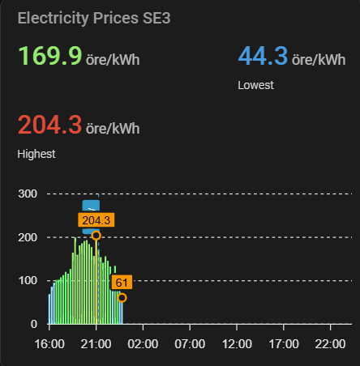

# ⚡ Elpriset Just Nu — Home Assistant Integration

[](https://github.com/hacs/integration)
[](https://github.com/TSA3000/ha-elprisetjustnu/releases)
[](https://www.home-assistant.io)

Real-time Swedish electricity prices (SE1–SE4) via [Elpriset Just Nu](https://www.elprisetjustnu.se/).
Supports the 15-minute price intervals introduced in Sweden in October 2025.

> *Elpriser tillhandahålls av [Elpriset just nu.se](https://www.elprisetjustnu.se)*

---

## ✨ Features

- **8 sensors:** today and tomorrow prices — current, highest, lowest, average, next
- **Selectable unit:** öre/kWh or SEK/kWh — switch anytime via Configure
- **VAT support:** include or exclude moms with a configurable rate (default 25%)
- **Last week comparison:** fetches last week's same weekday for chart overlay
- **15-minute intervals:** full 96-slot daily coverage
- **Smart attributes:** price trend, price level, tomorrow average, full price data
- **ApexCharts support:** `price_data` and `price_data_last_week` for mixed charts
- **Error recovery:** keeps last known values if the API is temporarily unavailable
- **Device grouping:** all sensors under one Device in Home Assistant
- **Diagnostics:** download debug info from the HA UI for easy troubleshooting
- **UI configuration:** no YAML required — all settings changeable via Configure
- **Zero external dependencies:** uses only Python built-ins and Home Assistant libraries

---

## 📥 Installation via HACS

1. Open **HACS** → click ⋮ → **Custom repositories**
2. Paste `https://github.com/TSA3000/ha-elprisetjustnu` → Category: **Integration** → **Add**
3. Find **Elpriset Just Nu** → click **Download**
4. **Restart Home Assistant**

## 📥 Manual Installation

1. Download this repository as a ZIP file
2. Copy `custom_components/elprisetjustnu/` into your HA `custom_components/` directory
3. **Restart Home Assistant**

---

## ⚙️ Configuration

1. **Settings** → **Devices & Services** → **Add Integration**
2. Search for **Elpriset Just Nu**
3. Configure the following settings:

| Setting | Default | Description |
|---|---|---|
| Price area | SE3 | Swedish electricity zone (SE1, SE2, SE3, SE4) |
| Unit | öre/kWh | öre/kWh or SEK/kWh |
| Include VAT (moms) | ✅ On | Apply VAT to all prices |
| VAT rate (%) | 25 | Only used when Include VAT is on |
| Show unit on sensors | ✅ On | Display unit label on sensor values |

4. Click **Submit**

> To change any setting later, click **Configure** on the integration card — no need to remove and re-add.

> Each price area can only be configured once.

---

## 📊 Sensors (example: SE3 device)

### Today

| Sensor | Description |
|---|---|
| Current Price | Live price in your selected unit |
| Highest Price | Daily high |
| Lowest Price | Daily low |
| Average Price | Daily average |
| Next Price | Price for the next 15-min slot |

### Tomorrow

| Sensor | Description |
|---|---|
| Highest Price Tomorrow | Tomorrow's high — available after ~13:00 CET |
| Lowest Price Tomorrow | Tomorrow's low — available after ~13:00 CET |
| Average Price Tomorrow | Tomorrow's average — available after ~13:00 CET |

> Tomorrow sensors show `unknown` until the API publishes prices each afternoon.
> They update automatically on the next 15-minute poll after becoming available.

---

## 🔖 Attributes on Current Price sensor

| Attribute | Example value | Description |
|---|---|---|
| `price_trend` | `rising` | vs next 15-min slot |
| `price_level` | `cheap` | relative to today's range |
| `next_price` | `132.5` | next slot price |
| `price_data` | `[{"start": "...", "price": 177.55}, ...]` | today + tomorrow slots with timestamps |
| `price_data_last_week` | `[{"start": "...", "price": 95.2}, ...]` | last week same weekday, timestamps shifted +7 days |
| `all_prices_today` | `[112.3, 118.1, ...]` | flat list of today's prices |
| `data_points` | `96` | number of today's slots |
| `price_area` | `SE3` | configured area |
| `unit` | `öre/kWh` | selected unit |
| `vat_percent` | `25` | configured VAT rate |
| `includes_vat` | `true` | whether prices include VAT |
| `tomorrow_available` | `true` | whether tomorrow's prices are published |
| `tomorrow_average` | `145.2` | tomorrow's average price |

> **Note:** `price_data` includes both today and tomorrow when available. `price_data_last_week` contains the same weekday from last week with timestamps shifted +7 days, so they align perfectly when overlaid on a chart. All prices respect the VAT setting.

---

## 📈 Dashboard Charts

Requires [ApexCharts Card](https://github.com/RomRider/apexcharts-card) from HACS.

### Simple price chart



```yaml
type: custom:apexcharts-card
experimental:
  color_threshold: true
header:
  show: true
  title: Electricity Prices SE3
  show_states: true
  colorize_states: true
graph_span: 48h
span:
  start: day
now:
  show: true
  label: Now
  color: "#ffffff"
apex_config:
  chart:
    height: 280px
  legend:
    showForSingleSeries: false
  plotOptions:
    bar:
      borderRadius: 1
      columnWidth: "90%"
  xaxis:
    labels:
      datetimeFormatter:
        hour: HH:mm
    axisTicks:
      show: true
  yaxis:
    min: 0
    decimalsInFloat: 0
    forceNiceScale: true
  tooltip:
    x:
      format: "ddd HH:mm"
  annotations:
    xaxis:
      - x: new Date().setHours(0,0,0,0) + 86400000
        borderColor: "rgba(255,255,255,0.15)"
        strokeDashArray: 4
        label:
          text: Tomorrow
          orientation: horizontal
          borderWidth: 0
          style:
            background: "transparent"
            color: "rgba(255,255,255,0.5)"
            fontSize: 12px
            fontWeight: 400
            padding:
              left: 6
              right: 6
              top: 2
              bottom: 2
series:
  - entity: sensor.elpriset_just_nu_se3_current_price
    name: " "
    unit: " öre/kWh"
    type: column
    float_precision: 1
    show:
      extremas: true
      in_header: before_now
      header_color_threshold: true
    data_generator: |
      return entity.attributes.price_data.map((item) => {
        return [new Date(item["start"]).getTime(), item["price"]];
      });
    color_threshold:
      - value: 0
        color: "#64b5f6"
      - value: 30
        color: "#4fc3f7"
      - value: 60
        color: "#4dd0e1"
      - value: 90
        color: "#4db6ac"
      - value: 120
        color: "#66bb6a"
      - value: 150
        color: "#9ccc65"
      - value: 180
        color: "#d4e157"
      - value: 210
        color: "#ffee58"
      - value: 240
        color: "#ffca28"
      - value: 270
        color: "#ffa726"
      - value: 300
        color: "#ff7043"
      - value: 350
        color: "#ef5350"
      - value: 400
        color: "#e53935"
  - entity: sensor.elpriset_just_nu_se3_current_price
    name: Lowest
    unit: " öre/kWh"
    float_precision: 1
    show:
      in_chart: false
      in_header: true
    data_generator: |
      let prices = entity.attributes.price_data.map(x => x.price);
      return [[new Date().getTime(), Math.min(...prices)]];
  - entity: sensor.elpriset_just_nu_se3_current_price
    name: Highest
    unit: " öre/kWh"
    float_precision: 1
    show:
      in_chart: false
      in_header: true
    data_generator: |
      let prices = entity.attributes.price_data.map(x => x.price);
      return [[new Date().getTime(), Math.max(...prices)]];
```

### Mixed chart: Today vs Last Week

Shows today's prices as colored bars with last week's same weekday as a line overlay on a second Y-axis.

```yaml
type: custom:apexcharts-card
experimental:
  color_threshold: true
header:
  show: true
  title: Electricity Prices SE3 — vs Last Week
  show_states: true
  colorize_states: true
graph_span: 48h
span:
  start: day
now:
  show: true
  label: Now
  color: "#ffffff"
apex_config:
  chart:
    height: 280px
  legend:
    show: true
  plotOptions:
    bar:
      borderRadius: 1
      columnWidth: "90%"
  xaxis:
    labels:
      datetimeFormatter:
        hour: HH:mm
  yaxis:
    - seriesName: " "
      min: 0
      decimalsInFloat: 0
      forceNiceScale: true
    - seriesName: Last week
      opposite: true
      min: 0
      decimalsInFloat: 0
      forceNiceScale: true
  tooltip:
    x:
      format: "ddd HH:mm"
  annotations:
    xaxis:
      - x: new Date().setHours(0,0,0,0) + 86400000
        borderColor: "rgba(255,255,255,0.15)"
        strokeDashArray: 4
        label:
          text: Tomorrow
          orientation: horizontal
          borderWidth: 0
          style:
            background: "transparent"
            color: "rgba(255,255,255,0.5)"
            fontSize: 12px
            fontWeight: 400
series:
  - entity: sensor.elpriset_just_nu_se3_current_price
    name: " "
    unit: " öre/kWh"
    type: column
    float_precision: 1
    show:
      extremas: true
      in_header: before_now
      header_color_threshold: true
    data_generator: |
      return entity.attributes.price_data.map((item) => {
        return [new Date(item["start"]).getTime(), item["price"]];
      });
    color_threshold:
      - value: 0
        color: "#64b5f6"
      - value: 60
        color: "#4dd0e1"
      - value: 120
        color: "#66bb6a"
      - value: 180
        color: "#d4e157"
      - value: 240
        color: "#ffca28"
      - value: 300
        color: "#ff7043"
      - value: 400
        color: "#e53935"
  - entity: sensor.elpriset_just_nu_se3_current_price
    name: Last week
    unit: " öre/kWh"
    type: line
    float_precision: 1
    color: "rgba(255,255,255,0.4)"
    stroke_width: 2
    yaxis_id: Last week
    show:
      in_header: false
      extremas: false
    data_generator: |
      return (entity.attributes.price_data_last_week || []).map((item) => {
        return [new Date(item["start"]).getTime(), item["price"]];
      });
  - entity: sensor.elpriset_just_nu_se3_current_price
    name: Lowest
    unit: " öre/kWh"
    float_precision: 1
    show:
      in_chart: false
      in_header: true
    data_generator: |
      let prices = entity.attributes.price_data.map(x => x.price);
      return [[new Date().getTime(), Math.min(...prices)]];
  - entity: sensor.elpriset_just_nu_se3_current_price
    name: Highest
    unit: " öre/kWh"
    float_precision: 1
    show:
      in_chart: false
      in_header: true
    data_generator: |
      let prices = entity.attributes.price_data.map(x => x.price);
      return [[new Date().getTime(), Math.max(...prices)]];
```

> Replace `sensor.elpriset_just_nu_se3_current_price` with your actual entity ID.
> Find it under **Settings → Entities → search elprisetjustnu**.

---

## 💡 Automation examples

### Notify when tomorrow's prices are published

```yaml
automation:
  - alias: "Notify when tomorrow prices are available"
    trigger:
      - platform: template
        value_template: >
          {{ state_attr('sensor.elpriset_just_nu_se3_current_price',
             'tomorrow_available') == true }}
    action:
      - service: notify.mobile_app
        data:
          message: >
            Tomorrow's average price:
            {{ state_attr('sensor.elpriset_just_nu_se3_current_price',
               'tomorrow_average') }} öre/kWh
```

### Turn off heater when price is expensive

```yaml
automation:
  - alias: "Turn off heater on expensive prices"
    trigger:
      - platform: template
        value_template: >
          {{ state_attr('sensor.elpriset_just_nu_se3_current_price',
             'price_level') == 'expensive' }}
    action:
      - service: switch.turn_off
        target:
          entity_id: switch.heater
```

---

## 🔍 Diagnostics

If you need to report a bug, you can download diagnostics data directly from the HA UI:

**Settings → Devices & Services → Elpriset Just Nu → ⋮ → Download Diagnostics**

This provides a safe summary of your configuration and data state without exposing sensitive information.

---

## 🐛 Troubleshooting

Sensors may briefly show `unavailable` before ~13:00 CET — this is normal.
Tomorrow's prices are published by the API around that time each day.
The integration retries automatically on the next 15-minute cycle.

Check **Settings → System → Logs** for any errors prefixed with `elprisetjustnu`.

---

## 👨‍💻 Author

**Sam Mahdi** ([@TSA3000](https://github.com/TSA3000))
